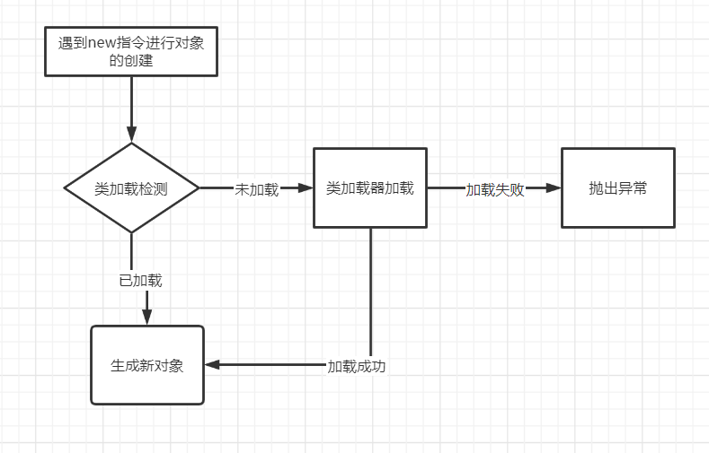
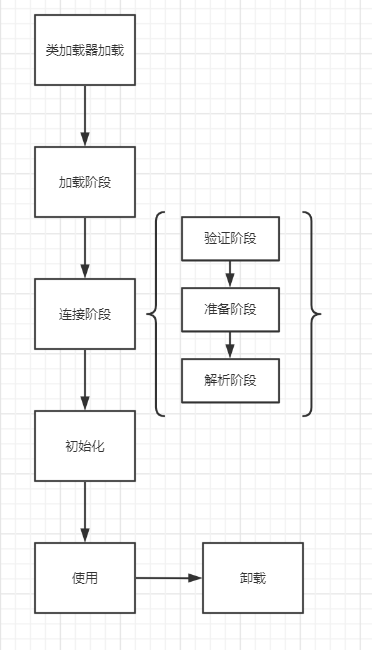

## java对象创建过程
----
#### 一、对象创建流程图


&emsp;&emsp;1. 当遇到显式或者隐式的创建对象的时候，首先会进行类加载检测；
&emsp;&emsp;2. 当目标类已经被加载那么我们可以通过对象访问标识去访问目标类；
&emsp;&emsp;3. 如果该类未被加载，那么JVM会通过类加载器进行类加载机制；


#### 二、类加载流程图



#### 三、类加载过程
###### &emsp;&emsp;1. 加载阶段
&emsp;&emsp;该阶段的任务是将目标类对应的字节码文件中的静态结构转存到方法区中，通过类的全限定名获取对应的字节码文件，然后将静态结构转化为方法区中的运行时数据；在加载阶段结束后，jvm外部的二进制字节流就会按照虚拟机所设定的格式存储在方法中，之后jvm会在堆内存中实例化一个class对象，这个对象将作为程序访问方法区中的类型数据的外部接口；

###### &emsp;&emsp;2. 验证阶段
&emsp;&emsp;验证阶段是穿插在类加载过程中进行的，为了确保class的字节流中的信息符合约束不会对虚拟机造成危害；验证有四个阶段：

&emsp;&emsp;a. 文件格式验证：只有文件验证阶段会对class文件进行验证，例如魔术，主次版本号；验证通过后字节流会存储进方法区中；
&emsp;&emsp;b.元数据验证：对方法区中的元数据进行验证，验证数据类型等是否符合规范；

&emsp;&emsp;c. 字节码验证：对数据流、控制流进行验证，确保程序的语义的正确性、合法性；

&emsp;&emsp;d. 符号引用验证：符号引用验证是在解析过程中发生的，在jvm将符号引用转化为直接引用的时候对常量池中各种符号引用的匹配性校验，被调用的外部对象是否缺失或禁止访问等等情况；

###### &emsp;&emsp;3. 准备阶段
&emsp;&emsp;为类中的变量分配内存并赋初值，如果是静态常量那么在编译期javac就会为这个常量生成一个属性去存储对应的值，并在准备阶段赋值；

###### &emsp;&emsp;4. 解析阶段
&emsp;&emsp;解析阶段很重要，它的任务是将常量池中对的符号引用转换为对应的直接引用，解析针对的对象主要是类、接口、字段、类方法、接口方法、方法类型等；

==解析重点==：解析的前提就是调用的方法必须是“编译器可知，运行期不可变”的，就是在编译器编译时期就需要能确定调用的唯一版本并且不会改变；

&emsp;&emsp;1. 方法的分类：虚方法、非虚方法

&emsp;&emsp;&emsp;&emsp;虚方法：虚方法就是除了非虚方法外的所有方法，java中的默认方法就是虚方法，通过invokevirtual指令执行的方法（除了被final修饰的方法）
&emsp;&emsp;&emsp;&emsp;非虚方法：非虚方法就是在解析阶段能确定唯一版本的方法，静态方法，私有方法，实力构造器，父类方法，final修饰的方法；这类方法都不会有重写版本；

&emsp;&emsp;2. 解析是一个静态过程，通过调用字节码进行的，首先通过验证阶段的符号引用验证确保所有对象中的所有外部对象有符号引用；
```java
class Test{
    public static void say(){
        sout(xxx);
    }
    public static void main(String[] args){
        静态方法在编译器编译阶段直接将常量池中的符号引用替换为对应方法的直接引用
        Test.say();
    }
}
```

&emsp;&emsp;&emsp;&emsp;在有重写和重载方法的时候就会用到分派；分派有动态分派和静态分配，静态分派是解决重载的版本选择，动态分派是在运行期间解决重写的版本选择；

&emsp;&emsp;Map为map的静态类型，HashMap是map的实际类型，也叫运行时类型；当遇到有重载版本的方法时，编译器在编译期间会通过静态分派去进行重载方法的版本选择，通过传入参数的静态类型去选择重载版本；当遇到重写版本方法时，在运行时虚拟机会通过指令去寻找方法接受者的实际类型；
```java
MapObject,Object map = new HashMap();
```

###### &emsp;&emsp;5. 初始化：执行clinit()和init()方法
###### &emsp;&emsp;6. 使用及卸载